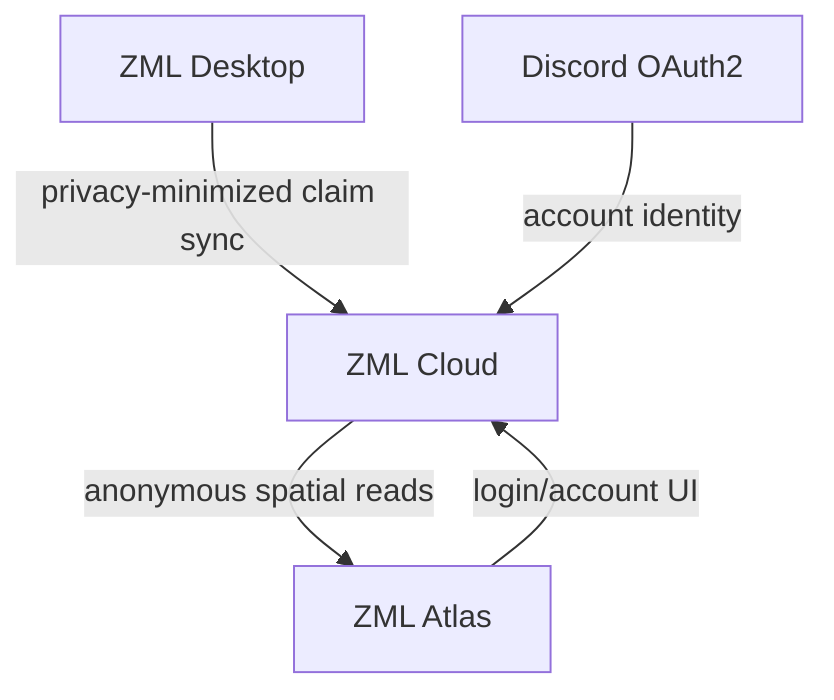

# ZML Atlas

ZML Atlas is the public community mining map for the Z Mining Log ecosystem.

Its initial purpose is simple: show **what mining resources have been found, where they were found, and at what claim sizes** using privacy-minimized observations synchronized by ZML Desktop users.

## Planned MVP

- one planet displayed at a time
- raw claim observations from the last 30 days by default
- viewport-based loading from ZML Cloud
- resource filtering
- claim-size filtering (`1..30`)
- claim timestamp/age display
- Discord login for account features
- desktop sync-token management for authenticated users

The first version should show real claim points. Heatmaps, clustering and automatically detected resource fields come after enough real data exists to design them correctly.

## Planned stack

- React
- TypeScript
- ZML Cloud HTTP API

The map library, styling system, build tooling and deployment provider should be selected when implementation begins rather than fixed without a concrete need.

## Ecosystem

ZML Atlas never connects directly to the cloud database. ZML Cloud owns authentication, validation, privacy boundaries and the public map contract.

## Documentation

- [`AGENTS.md`](AGENTS.md) - frontend/product constraints for implementation agents
- [`docs/architecture.md`](docs/architecture.md) - Atlas boundaries and data flow
- [`docs/product-scope.md`](docs/product-scope.md) - MVP and deliberate non-goals
- [`docs/map-api.md`](docs/map-api.md) - expected interaction with ZML Cloud map APIs

## Status

Product and architecture outline only. No frontend implementation has been bootstrapped yet.
