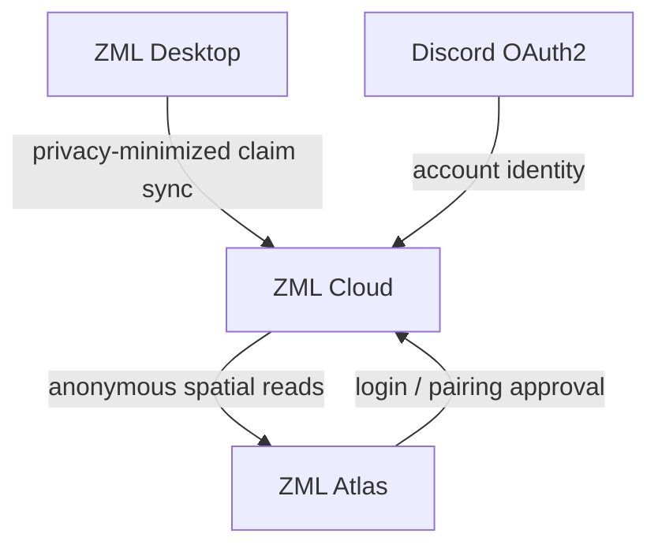

# ZML Atlas

ZML Atlas is the public community mining map for the Z Mining Log ecosystem.

Its initial purpose is simple: show **what mining resources have been found, where they were found, and at what claim sizes** using privacy-minimized observations synchronized by ZML Desktop users.

## MVP

- one planet displayed at a time
- raw claim observations from the last 30 days by default
- viewport-based loading from ZML Cloud
- resource filtering
- claim-size filtering (`1..30`)
- claim timestamp/age display
- Discord login for account features
- browser approval flow for connecting ZML Desktop

The first version should show real claim points. Heatmaps, clustering and automatically detected resource fields come after enough real data exists to design them correctly.

## Stack

- React + TypeScript
- Vite
- deck.gl with `OrthographicView` and Cartesian Entropia X/Y coordinates
- TanStack Query for server state
- plain CSS for the initial UI
- ZML Cloud HTTP API

Atlas does not use a geographic map engine. Entropia coordinates are planar game coordinates, so deck.gl owns the interactive viewport and GPU-rendered claim layers directly.

## Development

Requirements:

- Node.js 22.12+
- pnpm 10
- ZML Cloud on `http://localhost:8080` when testing account/pairing flows

```bash
pnpm install
pnpm dev
```

Vite serves Atlas locally and proxies `/api`, `/oauth2`, `/login`, `/logout`, and `/error` to ZML Cloud. Override the development cloud origin with `ZML_CLOUD_DEV_ORIGIN` when needed.

```bash
pnpm verify
```

The current bootstrap contains a clearly marked sample-point map preview. Real map observations will replace the fixture once the anonymous public read API exists.

### Desktop pairing

The `/pair?id=<pairing-id>&code=<browser-code>` page is the browser approval side of the ZML Desktop device-style pairing flow. Discord authentication stays on ZML Cloud; Atlas never receives Discord credentials or the final desktop `zml_...` token.

## Ecosystem



ZML Atlas never connects directly to the cloud database. ZML Cloud owns authentication, validation, privacy boundaries and the public map contract.

## Documentation

- [`AGENTS.md`](AGENTS.md) - frontend/product constraints for implementation agents
- [`docs/architecture.md`](docs/architecture.md) - Atlas boundaries and data flow
- [`docs/product-scope.md`](docs/product-scope.md) - MVP and deliberate non-goals
- [`docs/map-api.md`](docs/map-api.md) - expected interaction with ZML Cloud map APIs

## Status

Frontend bootstrap in progress. The map shell, deck.gl planar viewport, TanStack Query boundary and desktop-pairing approval page are implemented; public claim reads are the next map slice.
