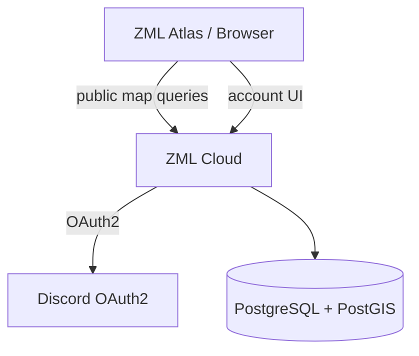
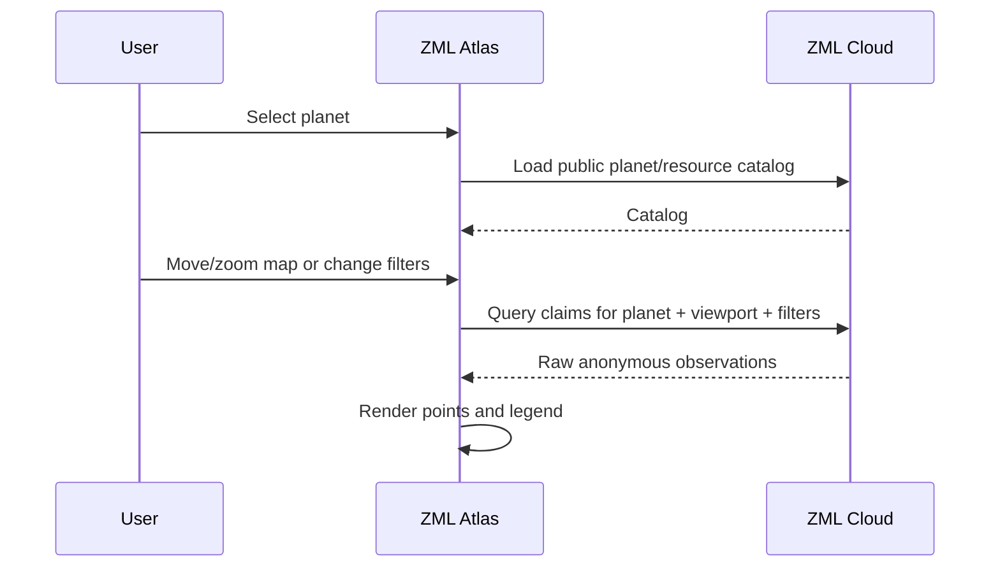

# Architecture

## Goal

ZML Atlas is a public React/TypeScript frontend over ZML Cloud's anonymous mining-map API.

It is intentionally not a second backend and does not own persistence, authentication rules, claim validation or privacy filtering.



## Frontend boundaries

Atlas owns:

- planet selection
- map viewport and coordinate presentation
- resource/size/time filters
- raw claim rendering
- map legends and interaction
- account UI for authenticated users
- desktop sync-token management UI

ZML Cloud owns:

- Discord OAuth2 integration and application identity
- sessions/authorization
- public/private API separation
- claim validation and persistence
- privacy filtering
- spatial queries
- catalog data
- future spatial aggregation

## Suggested frontend areas

The exact folder layout is not fixed, but preserve boundaries similar to:

```text
app/
api/
map/
catalog/
auth/
account/
```

Map rendering components should not contain raw HTTP logic. API DTO mapping and transport errors belong in the API layer.

## Map data flow



Avoid requesting data continuously while the user drags. Fetch after a stable/meaningful viewport change and ignore stale responses.

## Coordinate model

Entropia map coordinates are planar game coordinates. They are not geographic latitude/longitude.

Atlas needs a planet-specific mapping between game X/Y coordinates and the chosen map presentation. Keep this transformation isolated from generic UI logic.

Do not choose or configure a geographic projection by pretending game coordinates are EPSG:4326.

## Public vs authenticated UX

The mining map is public by default.

Authenticated Atlas areas are narrow:

- current account
- connected desktop/sync-token list
- create token
- revoke token

Discord login should be initiated through ZML Cloud. The frontend must never contain the Discord client secret.

## API strategy

Use a small typed API client boundary. When ZML Cloud publishes a stable OpenAPI contract, prefer generated transport types/client code over duplicating DTOs manually.

Public raw-claim responses must be treated as anonymous observations; the frontend should have no dependency on contributor/user fields.

## Future visualization architecture

Raw points are the MVP. Later ZML Cloud may expose derived spatial read models such as heatmap cells or resource-field polygons.

Atlas should add those as alternate layers:

```text
raw claims
heatmap
resource fields
recent activity
```

Do not replace or distort the raw claim layer merely to make a future heatmap easier to implement.
